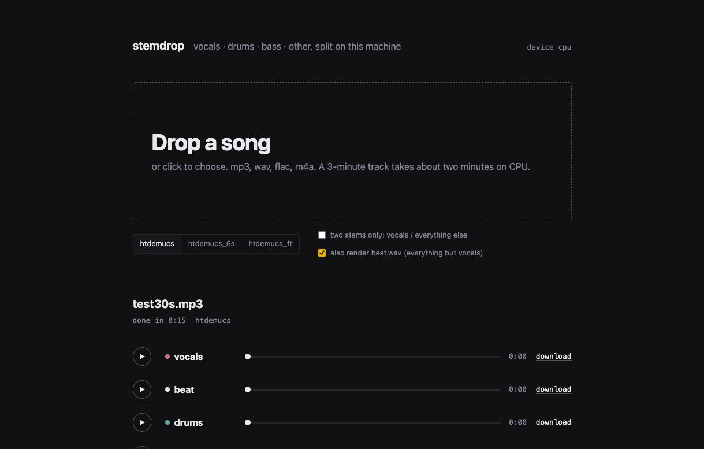

# stemdrop

A tiny local web app around [demucs](https://github.com/facebookresearch/demucs). Drop a song, get
**vocals / drums / bass / other** as 24-bit WAVs, plus an optional **beat.wav** (everything but the
vocals). Runs entirely on your machine. Nothing is uploaded anywhere.



## Setup

```
git clone https://github.com/carlitoswillis/stemdrop
cd stemdrop
./setup.sh      # makes .venv and installs demucs + flask (torch is big; give it a few minutes)
./run.sh        # opens on http://127.0.0.1:7860
```

Needs Python 3.10 to 3.13 and ffmpeg on PATH (used to read mp3 / m4a).
The first split downloads the model weights once (160 MB for the MLX build, 80 MB for the PyTorch build).

## Engines

On Apple Silicon, setup installs [demucs-mlx](https://github.com/ssmall256/demucs-mlx), a native MLX port of
demucs that runs on the GPU with no PyTorch. On an M-series Mac a 3-minute song takes about 5 seconds on
`htdemucs` and 15 seconds on `htdemucs_ft` once the weights are cached (160 MB per model, 640 MB for the
fine-tuned bag of four). Everywhere else it installs
Meta's PyTorch demucs, which runs on CPU or CUDA; a 3-minute song takes a couple of minutes on CPU. The header
of the page shows which engine is active. Same models, same stems either way.

## Options

- **Model.** `htdemucs` is the default and the fastest. `htdemucs_ft` is the fine-tuned version:
  cleaner, about three times slower. `htdemucs_6s` adds guitar and piano stems.
- **Two stems only.** Vocals vs. everything else, in one pass.
- **beat.wav.** Sums drums + bass + other, scaled down only if the sum would clip.

Flags: `./run.sh --port 8000`, `./run.sh --device cpu|cuda` (PyTorch engine only; the default is CPU unless
CUDA is present. Apple's MPS backend is not used because htdemucs crashes on it, which is why the MLX engine
exists).

## Where the files go

`jobs/<id>/out/<model>/<song>/` next to the app. The *open folder* link in the UI opens it in
Finder or your file manager.

## Why

Stem separation in a DAW is either a Live 12.3 feature, a paid website, or a CLI. This is the CLI
with a drop zone, built for mashups: split, listen to each lane, grab the beat.
